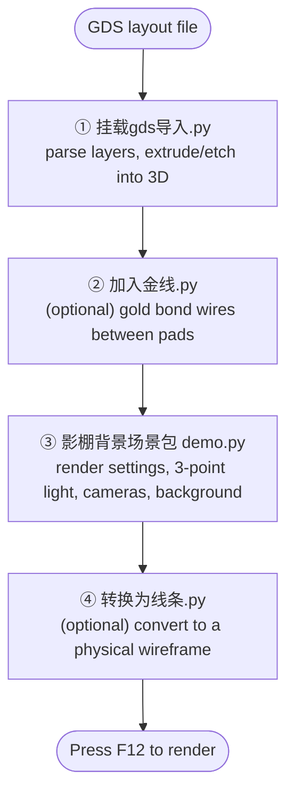

# gds2blender

[简体中文](README.md) | **English**

> Import chip layouts (**GDS** format) into Blender to build renderable 3D device models, and configure publication-grade studio lighting, cameras, and backgrounds in one click.

Built for **photonic / semiconductor device** figures and 3D visualization. The repository is a set of four independent Blender Python scripts covering the full "layout → final render" pipeline: GDS layer parsing, per-layer extrusion / boolean etching, gold bond wires, studio rendering, and wireframe conversion.

---

## Features

- **Real etching**: each layer can extrude "up (grow) / down (etch)"; down-layers use a true boolean operation to carve out of designated target layers, and the cut faces inherit the carved layer's material.
- **Sidebar UI**: the GDS importer adds a full panel to Blender's 3D viewport sidebar — no coding required.
- **Multiple structures**: import several GDS layouts into one scene, each individually named and positioned, and re-generate one without touching the others.
- **Save / load config**: per-layer parameters are saved next to the GDS file as a sidecar JSON, so the setup reproduces on another machine.
- **Studio quality**: three-point soft lighting + multiple cameras + three background styles + compositor glare, with one-click draft / 600 dpi switching.
- **Broad compatibility**: the studio script supports Blender 3.6 / 4.x / 5.0 and automatically handles the `$$$CONTEXT_INFO$$$` metadata and phantom 0/0 layer written by KLayout.

---

## Repository structure

| Script | Purpose | Stage |
|--------|---------|-------|
| [`挂载gds导入.py`](挂载gds导入.py) | **GDS core importer**: parse layout layers, extrude / boolean-etch into 3D, with a sidebar UI | Step 1 · required |
| [`加入金线.py`](加入金线.py) | Generate a row of arched gold bond wires between two pad rails | Optional |
| [`影棚背景场景包 demo.py`](影棚背景场景包%20demo.py) | **Studio render scene**: render settings + world background + three-point lighting + multiple cameras + ground/shadow + glare (does not assign materials) | Before rendering |
| [`转换为线条.py`](转换为线条.py) | Convert the generated solid model into a lit physical wireframe | Optional |

> The script file names and in-UI labels are in Chinese; this guide explains them in English.

---

## Requirements

| Software | Version | Notes |
|----------|---------|-------|
| Blender | 3.6+ (4.x recommended; studio script supports up to 5.0) | — |
| gdstk | latest | **Only the GDS importer needs it**; must be installed into Blender's bundled Python |

> The importer migrated from the unmaintained `gdspy` to **`gdstk`** (the officially recommended successor; PyPI ships prebuilt wheels, so installation is usually one shot).

### Installing gdstk

Important: it must go into **Blender's bundled Python** (for ABI compatibility), not your system Python. First locate Blender's python executable:

```text
Windows : <Blender>\python\bin\python.exe
macOS   : <Blender>.app/Contents/Resources/<version>/python/bin/python3.x
Linux   : <Blender>/<version>/python/bin/python3.x
```

Then install one of two ways:

```bash
# Option 1: install straight into Blender's site-packages (simplest)
"<Blender>/python/bin/python" -m pip install gdstk

# Option 2: install into a separate folder to keep Blender's env clean
"<Blender>/python/bin/python" -m pip install --target="D:/blender_pylibs" gdstk
```

With option 2, uncomment and edit this line near the top of [`挂载gds导入.py`](挂载gds导入.py) to point at your folder:

```python
sys.path.append(r"D:\blender_pylibs")
```

---

## Quick start

Run any script from Blender's **Scripting workspace** (paste into a new text block and run), or from the command line with `blender your.blend --python <script>.py`. Recommended flow:



1. Run **`挂载gds导入.py`** → configure each layer in the sidebar → generate the 3D structure
2. (Optional) Run **`加入金线.py`** to add bond wires between pads
3. Run **`影棚背景场景包 demo.py`** to set up lighting, cameras, and background
4. (Optional) Run **`转换为线条.py`** to switch to a wireframe style
5. Press **F12** to render

> ⚠️ The studio script **only lights the scene; it does not assign materials.** Model colors come from the per-layer colors set in the importer. For realistic metal / dielectric looks, assign materials yourself in Blender (the bond-wire script ships with its own gold material).

---

## Script reference

### ① `挂载gds导入.py` — GDS core importer

After it runs, a **`GDS Importer`** tab appears in the 3D viewport sidebar (press `N` to toggle), with a panel titled "GDS 极速导入器（真实刻蚀版）" (GDS Fast Importer — Real Etching). The panel is persistent. Workflow:

1. Pick a GDS file path → click **"1. 读取并分析 GDS 层"** (Read & analyze GDS layers) — all Layer/Datatype pairs are parsed automatically
2. Configure parameters → click **"2. 极速生成 3D 结构"** (Generate 3D structure)

**Per-layer parameters**

| Parameter | Meaning |
|-----------|---------|
| Enable / Color | Whether to generate the layer, and its color |
| Direction (方向) | **Up (grow/deposit)** = positive extrude; **Down (etch/carve)** = true boolean carving |
| Z start / Thickness | Starting height and extrude thickness |
| Carve targets (挖槽目标层) | Down-layers only. Comma-separated target layer names: enter `基底` to cut into the Substrate; `*` to cut all overlapping solids; **leave empty to carve nothing** (so you can place an up-growing structure inside the trench without it being cut) |

**Substrate**: toggleable, with top-face height, thickness, color, and **independent** outward padding on all four edges of the layout bounds (X- / X+ / Y- / Y+, in microns).

**Multiple structures / config**

- **Structure name + position (XYZ microns) + overwrite same-name**: import several layouts into one scene, each positioned independently; enabling overwrite re-generates a given structure without disturbing the others.
- **Save / load config**: layer parameters are written to a sidecar JSON (`<gds-path>.layers.json`) that travels with the GDS file.

**Dependency**: `gdstk` (see [installation](#installing-gdstk)).

---

### ② `加入金线.py` — gold bond wires

Generates `count` arched gold wires evenly spaced between "pad rail A" and "pad rail B" (each wire is a POLY curve + circular bevel = a solid gold tube with a metallic gold material). Commonly used to connect an InP RSOA chip's electrode pads to a carrier / external electrodes.

**Configuration**: edit the `make_bond_wire_array(...)` call at the bottom of the file —

```python
make_bond_wire_array(
    railA_start=(-0.90, 0.02, 0.10),  # rail A, first pad coordinate
    railA_end  =(-0.90, 0.10, 0.10),  # rail A, last pad coordinate
    railB_start=(-0.70, 0.02, 0.10),  # rail B, first pad coordinate
    railB_end  =(-0.70, 0.10, 0.10),  # rail B, last pad coordinate
    count=6,        # number of wires
    height=0.05,    # arch height above the pads
    radius=0.004,   # wire radius
    apex=0.4,       # apex position toward the start, 0–1
)
```

All coordinates are Blender **world coordinates**. The file header documents four ways to measure coordinates and provides three console helpers that print coordinates directly: `print_cursor()`, `print_selected()`, `print_object_top("object_name")`.

> 💡 Safe to re-run (`purge_wires()` at the top clears the previous batch). Tip: set `count` to `1` first to place a single wire and confirm both ends land on the pads, then restore the real count.

---

### ③ `影棚背景场景包 demo.py` — studio render scene

Sets up publication-grade lighting and framing in one click. It **only creates / updates `FIG_`-prefixed objects (lights / cameras / ground) plus world and render settings — it never touches your model geometry or materials**, and is safe to re-run. Edit the config block at the top of the file:

| Setting | Values | Meaning |
|---------|--------|---------|
| `DRAFT` | `True` / `False` | Fast draft preview / high-res output (auto-switches DPI and samples) |
| `EXPOSURE` | stops (EV) | **Master brightness control**; more negative = darker, typically `-1.2 ~ -0.3` |
| `BACKGROUND_STYLE` | `FLAT_DARK` / `DARK_GRADIENT` / `LIGHT_STUDIO` | Dark-gray flat / dark-blue radial gradient with vignette / light-gray studio |
| `ACTIVE_CAMERA` | `1` / `2` / `3` | Output close-up / waveguide top view / straight-down top-down view |
| `GROUND_MODE` | `STUDIO` / `SHADOW_CATCHER` | Solid ground + contact shadow / transparent, shadow-only (for compositing onto a white paper background) |
| `TARGET_WIDTH_MM` | millimeters | Layout width: ~180 for two-column, ~88 for single-column |

> Framing: numpad `0` enters camera view; to switch cameras, select the target camera and press `Ctrl`+numpad `0`. All three cameras are created.

---

### ④ `转换为线条.py` — wireframe rendering

Adds a Wireframe modifier to every mesh under the structure root, replacing solid faces with a hollow physical wireframe. Wire thickness `WIRE_THICKNESS` defaults to `0.5` (layout units); edit it at the top of the script.

**Target resolution** (automatic, no config needed):

1. If `TARGET_ROOT` is set and exists, use it (you can enter the importer's **structure name**, default `GDS_Chip`).
2. Otherwise, if objects are selected, process the structure(s) they belong to.
3. Otherwise, process every GDS structure in the scene (empties that have mesh children).

> ⚠️ **Prerequisite**: generate the model with the importer first. If nothing is found, the script tells you to run the importer, set `TARGET_ROOT`, or select a structure and re-run.

---

## Tips & troubleshooting

- **GDS units** are treated as microns by default; adjust with the importer's "缩放" (Scale) parameter.
- **Etch-layer cost**: down-layer boolean carving runs on `gdstk`; complex layouts may take a few seconds.
- **Phantom 0/0 layer**: the importer automatically removes the `$$$CONTEXT_INFO$$$` metadata cell written by tools like KLayout — no manual cleanup needed.
- **Substrate padding** also extends the etch mask boundary, keeping the two perfectly aligned.
- **`gdstk` not found**: make sure it was installed into *Blender's bundled* Python, not your system Python (see [installation](#installing-gdstk)).
