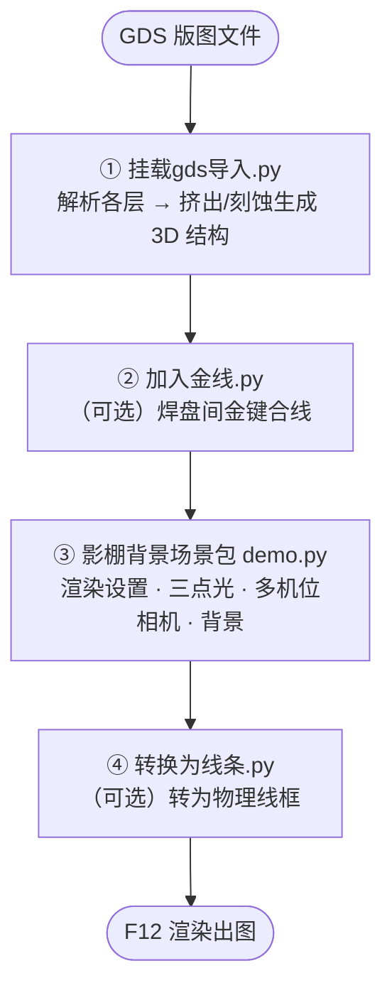

# gds2blender

**简体中文** | [English](README.en.md)

> 将芯片版图（**GDS** 格式）导入 Blender，生成可渲染的三维器件模型，并一键配置出版级的影棚布光、相机与背景。

面向**光子 / 半导体器件**的论文配图与三维可视化。仓库由四个相互独立的 Blender Python 脚本组成：从 GDS 版图解析、按层挤出 / 布尔刻蚀生成实体，到加键合金线、影棚渲染、线框风格转换，覆盖「版图 → 成片」的完整流程。

---

## 功能特性

- **真实刻蚀**：每层可选「向上生长 / 向下刻蚀」，向下层用真实布尔运算从指定目标层挖槽，切面继承被切层材质
- **侧边栏 UI**：GDS 导入器在 Blender 3D 视图侧边栏提供完整操作面板，无需写代码
- **多结构共存**：可在同一场景导入多块 GDS、各自命名与定位，并定向更新其中一个而不影响其它
- **配置可存取**：层参数随 GDS 文件以旁路 JSON 保存 / 载入，换台机器照样复现
- **出版级影棚**：三点柔光 + 多机位相机 + 三选一背景 + 合成器辉光，草稿 / 600dpi 一键切换
- **兼容性强**：影棚脚本兼容 Blender 3.6 / 4.x / 5.0，自动处理 KLayout 写出的 `$$$CONTEXT_INFO$$$` 元数据与幻影 0/0 层

---

## 仓库结构

| 脚本 | 作用 | 在流程中的位置 |
|------|------|----------------|
| [`挂载gds导入.py`](挂载gds导入.py) | **GDS 核心导入器**：解析版图各层，挤出 / 布尔刻蚀生成 3D 结构，带侧边栏 UI | 第一步 · 必需 |
| [`加入金线.py`](加入金线.py) | 在两排焊盘之间生成一排拱形金键合线（bond wire） | 可选 |
| [`影棚背景场景包 demo.py`](影棚背景场景包%20demo.py) | **影棚渲染场景**：渲染设置 + 世界背景 + 三点柔光 + 多机位相机 + 地面/阴影 + 辉光（不指派材质） | 出图前 |
| [`转换为线条.py`](转换为线条.py) | 把已生成的实体模型转换为带光照的物理线框 | 可选 |

---

## 环境要求

| 软件 | 版本 | 说明 |
|------|------|------|
| Blender | 3.6 及以上（推荐 4.x，影棚脚本兼容到 5.0） | — |
| gdstk | 最新版 | **仅 GDS 导入器需要**，须装进 Blender 自带的 Python |

> 导入器已从停止维护的 `gdspy` 迁移到 **`gdstk`**（官方推荐的继任者，PyPI 提供预编译 wheel，安装基本一次过）。

### 安装 gdstk

关键：必须装进 **Blender 自带的 Python**（保证 ABI 匹配），而不是系统 Python。先找到 Blender 的 python 可执行文件：

```text
Windows : <Blender>\python\bin\python.exe
macOS   : <Blender>.app/Contents/Resources/<版本>/python/bin/python3.x
Linux   : <Blender>/<版本>/python/bin/python3.x
```

然后二选一安装：

```bash
# 方式一：直接装进 Blender 的 site-packages（最简单）
"<Blender>/python/bin/python" -m pip install gdstk

# 方式二：装到独立目录，避免污染 Blender 自带环境
"<Blender>/python/bin/python" -m pip install --target="D:/blender_pylibs" gdstk
```

用方式二时，需在 [`挂载gds导入.py`](挂载gds导入.py) 顶部取消注释并改成你的目录：

```python
sys.path.append(r"D:\blender_pylibs")
```

---

## 快速开始

四个脚本都在 Blender 的 **Scripting 工作区**新建脚本粘贴运行，或用命令行 `blender your.blend --python 脚本名.py`。推荐流程：



1. 运行 **`挂载gds导入.py`** → 侧边栏配置各层参数 → 生成 3D 结构
2. （可选）运行 **`加入金线.py`** 在焊盘间补金线
3. 运行 **`影棚背景场景包 demo.py`** 配置布光、相机与背景
4. （可选）运行 **`转换为线条.py`** 切换为线框风格
5. 按 **F12** 渲染

> ⚠️ 影棚脚本**只布光、不指派材质**。模型颜色来自导入器里每层设定的颜色；若要金属 / 介质等真实质感，请自行在 Blender 中赋材质（金线脚本会自带金色材质）。

---

## 脚本详解

### ① `挂载gds导入.py` — GDS 核心导入器

运行后会在 **3D 视图侧边栏**（按 `N` 调出）出现 **`GDS Importer`** 标签页，面板名「GDS 极速导入器（真实刻蚀版）」。面板常驻，操作流程：

1. 选择 GDS 文件路径 → 点击 **「1. 读取并分析 GDS 层」**（自动解析所有 Layer/Datatype）
2. 配置参数 → 点击 **「2. 极速生成 3D 结构」**

**逐层参数**

| 参数 | 说明 |
|------|------|
| 启用 / 颜色 | 是否生成该层、该层颜色 |
| 方向 | **向上（生长/沉积）** 正向挤出；**向下（刻蚀/挖槽）** 真实布尔挖槽 |
| Z 起点 / 厚度 | 该层起始高度与挤出厚度 |
| 挖槽目标层 | 仅向下层有效。逗号分隔目标层名：填 `基底` 切入 Substrate；填 `*` 切所有重叠实体；**留空则不挖任何层**（便于在槽内再放向上生长结构而不被切到） |

**基底（Substrate）**：可开关，支持顶面高度、厚度、颜色，以及对版图边界四个方向**独立**设置外扩增量（X- / X+ / Y- / Y+，单位微米）。

**多结构 / 配置存取**

- **结构名称 + 结构位置（XYZ 微米）+ 覆盖同名结构**：可在同一场景导入多块版图、各自定位；勾选「覆盖同名」可定向重建某个结构而不动其它
- **保存 / 载入配置**：层参数写入旁路 JSON（`<GDS路径>.layers.json`），随 GDS 文件走

**依赖**：`gdstk`（见上文[安装](#安装-gdstk)）

---

### ② `加入金线.py` — 金键合线（bond wire）

在「焊盘轨道 A」与「轨道 B」之间均匀生成 `count` 根拱形金线（POLY 曲线 + 圆形 bevel 实心金管，自带金属金材质），常用于把 InP RSOA 芯片电极焊盘连到载体 / 外部电极。

**配置**：编辑文件末尾的 `make_bond_wire_array(...)` 调用——

```python
make_bond_wire_array(
    railA_start=(-0.90, 0.02, 0.10),  # A 排第一个焊盘坐标
    railA_end  =(-0.90, 0.10, 0.10),  # A 排最后一个焊盘坐标
    railB_start=(-0.70, 0.02, 0.10),  # B 排第一个焊盘坐标
    railB_end  =(-0.70, 0.10, 0.10),  # B 排最后一个焊盘坐标
    count=6,        # 金线根数
    height=0.05,    # 拱顶离焊盘高度
    radius=0.004,   # 金线半径
    apex=0.4,       # 拱顶偏向起点的位置 0~1
)
```

坐标均为 Blender **世界坐标**。文件顶部详述了 4 种量坐标的方法，并提供三个控制台小工具直接打印坐标：`print_cursor()`、`print_selected()`、`print_object_top("物体名")`。

> 💡 反复运行安全（开头 `purge_wires()` 会清掉上一轮金线）。建议先把 `count` 设为 `1` 跑一根、确认两端正好落在焊盘上，再改回实际根数。

---

### ③ `影棚背景场景包 demo.py` — 影棚渲染场景

一键配置出版级布光与取景，**只创建 / 更新 `FIG_` 前缀的对象（灯光 / 相机 / 地面）与世界、渲染设置，不触碰模型几何、不改材质**，可反复运行。修改文件顶部的配置区即可：

| 配置项 | 取值 | 说明 |
|--------|------|------|
| `DRAFT` | `True` / `False` | 草稿快速预览 / 高清出图（自动切换 DPI 与采样数） |
| `EXPOSURE` | 档数（EV） | **整体亮度总开关**，越负越暗，常用 `-1.2 ~ -0.3` |
| `BACKGROUND_STYLE` | `FLAT_DARK` / `DARK_GRADIENT` / `LIGHT_STUDIO` | 深灰平背景 / 深蓝径向渐变+暗角 / 浅灰影棚 |
| `ACTIVE_CAMERA` | `1` / `2` / `3` | 出光特写 / 波导俯视 / 正上方垂直俯瞰 |
| `GROUND_MODE` | `STUDIO` / `SHADOW_CATCHER` | 实色地面+接触阴影 / 透明只接阴影（便于后期合成到论文白底） |
| `TARGET_WIDTH_MM` | 毫米 | 版面宽度，双栏 ~180、单栏 ~88 |

> 取景：小键盘 `0` 进相机视角；想切机位，选中目标相机后 `Ctrl`+小键盘 `0`。三个相机都会建好。

---

### ④ `转换为线条.py` — 线框渲染

给结构根物体下的所有子网格添加 Wireframe 修改器，替换实体面、生成镂空的物理线框。线框粗细 `WIRE_THICKNESS` 默认 `0.5`（版图单位），在脚本顶部修改。

**自动识别目标结构**（无需配置）：

1. 若填了 `TARGET_ROOT` 且存在 → 用它（可填导入器里的**「结构名称」，默认 `GDS_Chip`**）
2. 否则若有选中物体 → 处理选中物体所在的结构
3. 否则 → 处理场景里所有 GDS 结构（带网格子物体的空物体）

> ⚠️ **运行前提**：必须先用导入器生成模型。若什么都没找到，脚本会提示先运行导入器、或填 `TARGET_ROOT` / 先选中目标结构。

---

## 提示与排错

- **GDS 坐标单位**默认按微米处理，可用导入器的「缩放」参数调整
- **刻蚀层耗时**：向下层的布尔挖槽基于 `gdstk`，复杂版图可能耗时数秒
- **幻影 0/0 层**：导入器会自动剔除 KLayout 等工具写出的 `$$$CONTEXT_INFO$$$` 元数据 cell，无需手动处理
- **基底外扩**同时作用于刻蚀掩膜边界，保持两者完全对齐
- **找不到 `gdstk`**：确认是装进了 *Blender 自带* 的 Python，而非系统 Python（见[安装](#安装-gdstk)）
